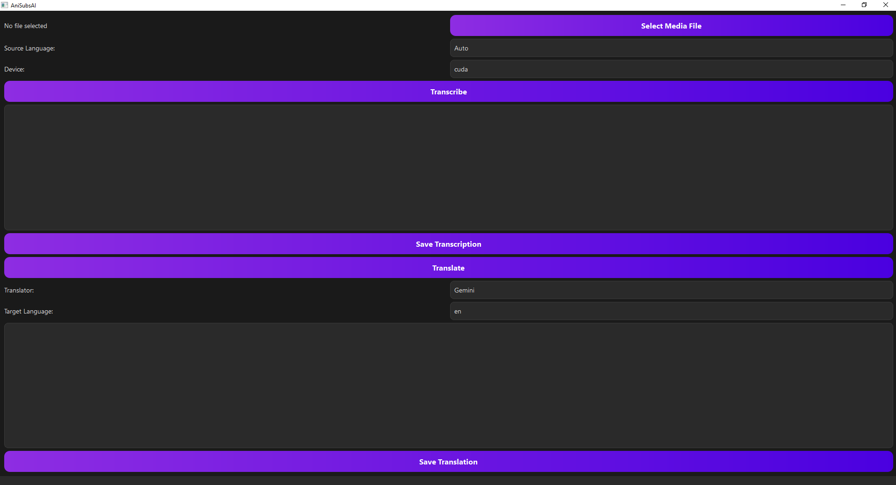

# AniSubsAI

A desktop application for transcribing and translating audio files to generate subtitles, built with Python and PyQt6.

## Overview

AniSubsAI provides a user-friendly interface to:
-   **Transcribe Audio & Video:** Process both audio and video files, automatically extracting audio from videos.
-   **Multi-Engine Translation:** Translate text using a variety of services, including Gemini, Google Translate, DeepL, and more.
-   **Flexible Subtitle Generation:** Generate subtitles in multiple standard formats, including SRT, VTT, and ASS.
-   **Advanced Customization:**
    -   Select from a wide range of source and target languages.
    -   Automatically detect the source language.
    -   Choose your processing device (CPU/GPU) for transcription.
    -   Easily switch between different `faster-whisper` models.

The application is designed with a modern, dark-themed UI and a modular architecture that allows for future expansion, such as adding more translation services.

## Screenshot



## Features

-   **Video and Audio Support:** Transcribe directly from `.mp3`, `.wav`, `.mp4`, and `.mkv` files.
-   **High-Quality Transcription:** Powered by `faster-whisper` for fast and accurate speech-to-text.
-   **Multi-Engine Translation:** Choose between Gemini, Google Translate, DeepL, Microsoft Translator, and MyMemory.
-   **Automatic Language Detection:** Let the application automatically detect the source language of your media.
-   **Multiple Export Formats:** Save your subtitles as `.srt`, `.vtt`, `.ass`, or plain `.txt` files.
-   **Drag and Drop:** Easily add files to the application by dragging them onto the window.
-   **Device Selection:** Choose between CPU and GPU for transcription to balance speed and resource usage.
-   **Customizable Models:** Easily switch between different `faster-whisper` models (e.g., small, medium, large) via the `.env` file.
-   **Modern UI:** A sleek, responsive interface built with PyQt6.

## Setup and Installation

1.  **Clone the repository:**
    ```bash
    git clone <repository-url>
    cd AniSubsAI
    ```

2.  **Create a virtual environment:**
    ```bash
    python -m venv venv
    source venv/bin/activate  # On Windows, use `venv\Scripts\activate`
    ```

3.  **Install dependencies:**
    ```bash
    pip install -r requirements.txt
    ```

4.  **Configure your environment:**
    -   Create a `.env` file in the root of the project.
    -   Add your Gemini API key to the `.env` file if you plan to use the Gemini translator:
        ```
        GEMINI_API_KEY="YOUR_API_KEY_HERE"
        ```
    -   (Optional) Customize the `WHISPER_MODEL` and `GEMINI_MODEL` in the `.env` file.

5.  **(Optional) GPU Support:**
    For GPU-accelerated transcription, you will need to have the NVIDIA CUDA Toolkit installed and then install the following dependencies:
    ```bash
    pip install torch torchvision torchaudio --index-url https://download.pytorch.org/whl/cu121
    ```

## How to Run

Once the setup is complete, you can run the application with the following command:

```bash
python main.py
```

## Project Structure

The project is organized into the following directories:

-   `core/`: Shared utilities and configuration.
-   `gui/`: All PyQt6 GUI components, stylesheets, and workers.
-   `models/`: The directory where `faster-whisper` models are downloaded and stored.
-   `transcriber/`: The `faster-whisper` transcription logic.
-   `translator/`: The Gemini translation logic.
-   `main.py`: The main entry point for the application.